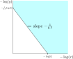

# Details on Janushash 

## Definition

- Each hash (32 byte hex string) can be interpreted as a number in the interval $[0,1)$. 
    - For example the hash `FFFF...FFFF` would correspond to 1-2^256 which is almost 1 and 
    - the hash `0000...0000` would correspond to 0. 
    - **Note**: A hash cannot correspond to exactly 1 but almost 1. 
- For some byte sequence $b$ we denote
    - the verus hash interpreted as a number in $[0,1)$ by $x(b)$ and
    - the triple sha256 hash interpreted as a number in $[0,1)$ by $y(b)$.
- From now on we will omit the dependency on $b$ and will just write $x$ and $y$ instead of $x(b)$ and $y(b)$ respectively.
- We define the number $j\in [0,1)$ by
$$j := x y^{0.7}$$
- $j$ depends implicitly on the hashed byte sequence $b$.
- Similar to above where we converted a hash to a number we can do the reverse, i.e. interpret a number in $[0,1)$ as a hash.
- **Note**: To represent a small number as a hash, one might require more than 32 digits, there exist transcendental numbers which even require infinite digits to be represent exactly. However this is not of interest for us.
- The Janushash of $b$ is the number $j$ interpreted as a hash. 
- We will solely work with the number $j$ and will never explicitly consider the Janushash (hash equivalent of $j$). All theory works with numbers, so implementation only needs to convert hashes to numbers, but not numbers to hashes.
- For convenience from now on we will be sloppy and call $j$ the Janushash, despite $j$ is actually the number representation of the Janushash.


## Condition to solve a block

- We define the condition to solve a block by
$$j < t,$$ 
- Here $j$ is the janushash of the block header, i.e. one needs to compute triple sha256 and verushash of the header to compute $j$, and $t\in[0,1]$ is the target. 
- The target controls the difficulty, obviously if the target is decreased then the condition to solve a block is more difficult to satisfy and vice versa.
### Mining difficulty
- The number of block headers that a miner needs to try until it finds a janushash that solves a block is random, more precisely it is [geometrically distributed](https://en.wikipedia.org/wiki/Geometric_distribution) because it is [memoryless](https://en.wikipedia.org/wiki/Memorylessness) (not having found a block for some time does not change the probability to find a block in the future, this is a fundamental property in mining).
- Mining difficulty $d$ is defined as the average number of required of tries, i.e. the [expectation](https://en.wikipedia.org/wiki/Expected_value).
- **Main question**: How exactly does $t$ control the mining difficulty?
- Answer: To be precise this depends on the mining style (how much filtering is used in filtered mining, to be explained later) but in practice with a very good approximation 
    - we can just ignore the dependence in mining style (TODO: prove this but I know it's true :D) and
    - we can just use the normal retargeting mechanism of traditional PoW cryptocurrencies (I have shown this in my paper[^1], Lemma III.1).


## More insight on the log scale
Recall that the condition to solve a block is $xy^{0.7} < t$. 
It is more convenient to work on the logarithmic scale. So we apply the logarithm on both sides of the equation to reformulate the condition:
$$\log(x) + 0.7 \log(y) < \log(t)$$
Recall that $x$ and $y$ are less than 1. This means $-\log(x)$ and $-\log(y)$ are positive. We can therefore visualize the *acceptance region* (blue area, region where $xy^{0.7}< t$ is satisfied) in the first [quadrant](https://en.wikipedia.org/wiki/Quadrant_(plane_geometry)) of a [Cartesian coordinate system](https://en.wikipedia.org/wiki/Cartesian_coordinate_system) representing $-\log(x)$ and $-\log(y)$ along its axes:

<p align="center">
  
</p>

In the log scale the boundary of the acceptance region is formed by straight lines, and it extends infinitely along the two axes.

# Pools

Conventional Proof of Work pools provide a service to allow miners to collaboratively find a proof of work that is too difficult for them to solve alone. The main benefit is the reduction of variance in mining income and since most people don't like variance they are willing to pay a small fee to reduce income variance (for the same reason insurances exist despite they cost more than they provide on average).

## Nested Tasks and their associated value
Mining pools provide simpler Proof of Work tasks to miners. Miners solve the simpler tasks to prove their contribution to the pool. It is essential that some solutions to the simpler tasks are also solutions to the difficult task that solves a block otherwise the pool tasks sent to miners would not be useful for solving a block. Pools must be able to send tasks at granular difficulty level to match the hashrate of the miner such that the miner does not solve its task too often nor too rarely. This means that their tasks are *nested* in the sense that a more difficult task is also a solution to an easier pool task. We can think of this as a nested chain of tasks where mining the block itself is the most difficult task that is contained in all other tasks (in the sense of mathematical set theory). Furthermore each task must have a value assigned such that the pool can count the contribution of each miner correctly. The value of a task should match the difficulty to allow the pool to correctly estimate each miner's contribution. 

## Acceptance regions for pool tasks

In traditional Proof of Work pools just send out headers with a simpler target. This is a very easy setting because we can easily understand and control the difficulty. If we require one zero less, this halves the difficulty and the value of a solved pool task (i.e. of a share), if we require one additional zero, this doubles the difficulty and the value. Furthermore this kind of tasks are nested because providing a hash starting with a specified number of zeros also is a solution to a task which requires less leading zeros.

However in Janushash things are much more complicated :D
- Firstly we now have two dimensions instead of just one (one for verushash and one for triple sha256)
- Secondly different mining styles (balance of GPU/CPU capabilities)  might behave differently in how difficult pool tasks are solvable. This would be a disaster, if the pool cannot understand how difficult its tasks are it cannot assign a value to estimate contribution value of a share.

Luckily the god of mathematics shines his light on us and makes this problem solvable. In fact we can find a nested set of two-dimensional acceptance regions such that *any* mining style behaves equally, i.e. we can find interesting two-dimensional shapes that have equal probability to be hit by a janushash, no matter how much GPU vs CPU performance is. This allows us to assign a value to them to keep track of miner contribution on pool side without knowing its mining style. Think about it: if such regions did not exist, fair pool mining would not be possible with Janushash. So we are very lucky that they exist!

The only bad news is we need to hard-code some constants on pool and miner side to describe these nested acceptance regions of pool tasks. The good news is I already computed them numerically such that miner/pool devs can just copy/paste them in their code, see below.
### How to find the acceptance region for pool tasks?
NOTE: This section lacks proper explanation, it is just a raw skeleton for now, I will provide detailed explanation soon. 

We define $T(x):=\int_0^x e^{-t}e^{-f(t)-f(x)}\text{d}t$. With this definition we get

$$
\begin{align*} 
F(x) &= \underbrace{\int_0^x e^{-t}e^{-(f(t)-f(x))}\text{d}t}_{T(x)} + e^{-x}=e^{f(x)}\int_0^x e^{-t-f(t)}\text{d}t +e^{-x}\\ 
F'(x) &= f'(x)T(x)+e^{f(x)}e^{-x-f(x)}-e^{-x} =f'(x)T(x)\\ 
\end{align*}
$$

$g(x) = -\frac{1}{\beta}x$ with $\beta=0.7$

Now let's calculate $G$ and $G'$.

$$
\begin{align*} 
G(x) &= \int_0^x e^{-t}e^{-(g(t)-g(x))}\text{d}t + e^{-x}=e^{-\frac{1}{\beta}x}\int_0^x e^{(\frac{1}{\beta}-1)t}\text{d}t +e^{-x}\\ 
&=e^{-\frac{1}{\beta}x}\big[\tfrac{1}{(\frac{1}{\beta}-1)} e^{(\frac{1}{\beta}-1)t}\big]_{t=0}^x-e^{-x} = \tfrac{\beta}{(1-\beta)}\big(e^{-x}-e^{-\frac{1}{\beta}x}\big) + e^{-x}\\
&=\tfrac{1}{(1-\beta)}\big(e^{-x}-\beta e^{-\frac{1}{\beta}x}\big)\\
G'(x) &= \tfrac{1}{(1-\beta)}\big(-e^{-x}+e^{-\frac{1}{\beta}x}\big)
\end{align*}
$$

$$
\begin{align*} 
H(x) &= G(-\beta f(x))\\
H'(x) &= -\beta f'(x)G'(-\beta f(x))\\
\end{align*}
$$

The condition we want for pool mining is $\alpha F(x) = H(x)$ for all $x>=0$ where $\alpha \in (0,1)$ is the fraction of share value of a solved block. It follows that

$$
\begin{align*} 
H(x) &= \alpha F(x) = \alpha (T(x)+e^{-x})\\
H'(x) &= \alpha F'(x) = \alpha f'(x)T(x)\\
\end{align*}
$$

If we solve the first equation above for $T(x)$ and plug this into the second equation we get

$$
-\beta f'(x) G'(-\beta f(x)) = H'(x) = f'(x)(H(x)-\alpha e^{-x}),
$$

This is either satisfied for $f'(x) = 0$ or for

$$
\begin{align*} 
0 &= H(x)-\alpha e^{-x}+\beta G'(-\beta f(x))\\
 &= G(-\beta f(x))+\beta G'(-\beta f(x))-\alpha e^{-x}\\
 &= \tfrac{1}{(1-\beta)}\big(e^{\beta f(x)}-\beta e^{f(x)}\big)
+\beta \tfrac{1}{(1-\beta)}\big(-e^{\beta f(x)}+e^{f(x)}\big)-\alpha e^{-x}\\
 &= e^{\beta f(x)} -\alpha e^{-x}\\
\end{align*}
$$

from which we find $f(x)=-\frac{1}{\beta}x +\frac{\log(\alpha)}{\beta}$. But as we saw before this condition is just required for $f'(x)\not=0$. 
This means that the $f$ is composed of constant sections ($x$ where $f'(x)=0$ and sections where $f(x)=-\frac{1}{\beta}x +\frac{\log(\alpha)}{\beta}$. This gives us an idea how the correct function looks like. The correct function $f$ is

$$
f_{\alpha}:
\begin{cases}
\mathbb{R}_{\ge 0} &\to \mathbb{R}\\
x&\mapsto
\min(-c_{\alpha}, -\frac{1}{\beta}x +\frac{\log(\alpha)}{\beta})
\end{cases},
$$

where the positive constant $c_{\alpha}$ is chosen such that 
$\alpha= \tfrac{1}{(1-\beta)}\big(e^{-\beta c_\alpha}-\beta e^{-c_\alpha}\big)$. The reader can easily verify that indeed this function satisfies the equation

$$H(x) = \alpha F(x) \textnormal{ for all }x\ge 0.$$

Values for $c_\alpha$ must be precomputed for fixed $\beta=0.7$ in order evaluate $f_\alpha$ in pools and miners.

### Precomputing values for $c_\alpha$
<details>
  <summary> Julia code to precompute values</summary>

```julia
using Roots
beta = 0.7
for i = 1:100
    p(x) = log(1/(1-beta))+log(exp(-beta*x))+log(1 - beta*exp(-(1-beta)*x))-i*log(1/2)
    root = find_zero(p, (0,400), Bisection())
    println("c_alpha for alpha = 2^(-$i) ≈ $root")
end
```

</details>

<details>
  <summary> Table of precomputed values </summary>

$\alpha$ | $c_{\alpha}$
---------|-------------
$2^{-1}$ | `2.0240078767956975`
$2^{-2}$ | `3.26467020367989`
$2^{-3}$ | `4.394288840992969`
$2^{-4}$ | `5.472731744244513`
$2^{-5}$ | `6.52219327976034`
$2^{-6}$ | `7.553545024545997`
$2^{-7}$ | `8.572922537289955`
$2^{-8}$ | `9.584096317310902`
$2^{-9}$ | `10.589515587487824`
$2^{-10}$ | `11.590832562534855`
$2^{-11}$ | `12.5891916955424`
$2^{-12}$ | `13.58540082663572`
$2^{-13}$ | `14.580038009112693`
$2^{-14}$ | `15.573520991157688`
$2^{-15}$ | `16.566153869289867`
$2^{-16}$ | `17.558159191338017`
$2^{-17}$ | `18.549700466269613`
$2^{-18}$ | `19.540898175512883`
$2^{-19}$ | `20.53184128648575`
$2^{-20}$ | `21.52259560017043`
$2^{-21}$ | `22.513209840865642`
$2^{-22}$ | `23.503720119481823`
$2^{-23}$ | `24.494153216166737`
$2^{-24}$ | `25.484529000862032`
$2^{-25}$ | `26.474862221646834`
$2^{-26}$ | `27.46516382790318`
$2^{-27}$ | `28.455441950358125`
$2^{-28}$ | `29.445702627562884`
$2^{-29}$ | `30.435950344733506`
$2^{-30}$ | `31.426188433594447`
$2^{-31}$ | `32.41641936917795`
$2^{-32}$ | `33.40664499018884`
$2^{-33}$ | `34.39686666264867`
$2^{-34}$ | `35.38708540143535`
$2^{-35}$ | `36.37730196056039`
$2^{-36}$ | `37.36751690023017`
$2^{-37}$ | `38.35773063666429`
$2^{-38}$ | `39.34794347910603`
$2^{-39}$ | `40.338155657318524`
$2^{-40}$ | `41.32836734201312`
$2^{-41}$ | `42.31857866002671`
$2^{-42}$ | `43.30878970559813`
$2^{-43}$ | `44.29900054874621`
$2^{-44}$ | `45.28921124149458`
$2^{-45}$ | `46.279421822496495`
$2^{-46}$ | `47.26963232047122`
$2^{-47}$ | `48.25984275675699`
$2^{-48}$ | `49.25005314720808`
$2^{-49}$ | `50.24026350360414`
$2^{-50}$ | `51.23047383469741`
$2^{-51}$ | `52.2206841469908`
$2^{-52}$ | `53.210894445315915`
$2^{-53}$ | `54.20110473326267`
$2^{-54}$ | `55.19131501349831`
$2^{-55}$ | `56.181525288004615`
$2^{-56}$ | `57.17173555825405`
$2^{-57}$ | `58.16194582534064`
$2^{-58}$ | `59.15215609007725`
$2^{-59}$ | `60.14236635306781`
$2^{-60}$ | `61.132576614761085`
$2^{-61}$ | `62.12278687549047`
$2^{-62}$ | `63.11299713550369`
$2^{-63}$ | `64.1032073949848`
$2^{-64}$ | `65.09341765407056`
$2^{-65}$ | `66.08362791286257`
$2^{-66}$ | `67.07383817143632`
$2^{-67}$ | `68.0640484298479`
$2^{-68}$ | `69.05425868813902`
$2^{-69}$ | `70.0444689463406`
$2^{-70}$ | `71.03467920447567`
$2^{-71}$ | `72.02488946256132`
$2^{-72}$ | `73.01509972061025`
$2^{-73}$ | `74.0053099786319`
$2^{-74}$ | `74.99552023663328`
$2^{-75}$ | `75.9857304946196`
$2^{-76}$ | `76.97594075259474`
$2^{-77}$ | `77.96615101056155`
$2^{-78}$ | `78.95636126852219`
$2^{-79}$ | `79.94657152647824`
$2^{-80}$ | `80.93678178443088`
$2^{-81}$ | `81.92699204238097`
$2^{-82}$ | `82.9172023003292`
$2^{-83}$ | `83.90741255827602`
$2^{-84}$ | `84.89762281622181`
$2^{-85}$ | `85.8878330741668`
$2^{-86}$ | `86.87804333211126`
$2^{-87}$ | `87.86825359005528`
$2^{-88}$ | `88.85846384799896`
$2^{-89}$ | `89.84867410594242`
$2^{-90}$ | `90.83888436388571`
$2^{-91}$ | `91.82909462182886`
$2^{-92}$ | `92.81930487977193`
$2^{-93}$ | `93.8095151377149`
$2^{-94}$ | `94.79972539565784`
$2^{-95}$ | `95.78993565360074`
$2^{-96}$ | `96.7801459115436`
$2^{-97}$ | `97.77035616948643`
$2^{-98}$ | `98.76056642742924`
$2^{-99}$ | `99.75077668537207`
$2^{-100}$ | `100.7409869433149`
</details>


[^1]: *CoinFuMasterShifu* (2023). **[Proof of Balanced Work: The Theory of Mining Hash Products](https://github.com/CoinFuMasterShifu/ProofOfBalancedWork/blob/main/PoBW.pdf)**
