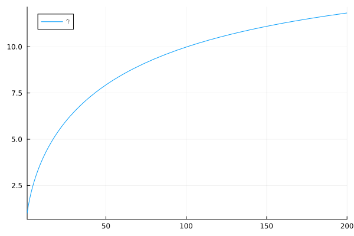

# Details on Janushash 

## Interpreting Hashes as Numbers

- Each hash (32 byte hex string) can be interpreted as a number in the interval $[0,1)$. 
    - For example the hash `FFFF...FFFF` would correspond to 1-2^256 which is almost 1 and 
    - the hash `0000...0000` would correspond to 0. 
    - **Note**: A hash cannot correspond to exactly 1 but almost 1. 
- For a block header $h$ we denote
    - the verus hash interpreted as a number in $[0,1)$ by $X(h)$ and
    - the triple sha256 hash interpreted as a number in $[0,1)$ by $Y(h)$.
- We define the Janushash number $J(h) = X(h)Y(h)^{0.7}$.
- Similar to above where we converted a hash to a number we can do the reverse, i.e. interpret $J(h)$ as a hash, this hash is the Janushash but we will never compute it or work with it, instead we will solely consider the number representation $J(h)$. All theory works with numbers, so implementation only needs to convert hashes to numbers, but not numbers to hashes For convenience we will call the Janushash number also *Janushash*.
- **Note**: To represent a small number as a hash, one might require more than 32 digits, there exist transcendental numbers which even require infinite digits to be represent exactly. However this is not of interest for us.


## Condition to solve a block

For target $t\in[0,1]$ we define the following three conditions a header $h$ must satisfy to have a valid Proof of Balanced Work:

1. The Janushash must be below the threshold $J(h) < t$.
2. The Janushash must not be too small $J(h) \ge t/10$.
3. The Sha256t must not be too small $Y(h) \ge c$ for some constant $c=e^{-6.5}\approx 0.001503439$

An equivalent formulation is to require that $(X(h),Y(h))$ must be an element of the *acceptance region* $A_t\subset [0,1]^2$ defined as

$$
A_t := \big\lbrace (x,y) \in [0,1]^2\big \vert t/10 \le xy^{0.7} < t \land y>c\big\rbrace
$$


The target controls the difficulty, obviously if the target is decreased then the condition to solve a block is more difficult to satisfy.
### More insight on the log scale
If we apply the logarithmic transformation on the acceptance region $A_t$, the condition

$$ t/10\le xy^{0.7} <t\land y>c $$
can be reformulated as
$$ -\log(t/10)\ge -\log(x)+0.7(-\log(y)) >-\log(t)\land -\log(y)<-\log(c) $$

Recall that $x$ and $y$ are less than 1. This means $-\log(x)$ and $-\log(y)$ are positive. We can therefore visualize the acceptance region $A_t$ in the first [quadrant](https://en.wikipedia.org/wiki/Quadrant_(plane_geometry)) of a [Cartesian coordinate system](https://en.wikipedia.org/wiki/Cartesian_coordinate_system) representing $-\log(x)$ and $-\log(y)$ along its axes.

The following figure depicts the situation in log scale, the acceptance region $A_t$ is colored light blue:
<p align="center">
  
</p>

## Probability Theory
### Distribution of hashes
A proper hash function should be random in the sense that each output bit cannot be predicted from the input and also cannot be predicted from other bits in its output. Therefore with the interpretation of a hash as a number in $[0,1)$ we can model the Verushash v2.1 $X(h)$ and the Sha256t $Y(h)$ of a header as samples of [uniform](https://en.wikipedia.org/wiki/Continuous_uniform_distribution) [random variable](https://en.wikipedia.org/wiki/Random_variable) on $[0,1]$. Since we use two different hash functions we can model the vector $(X(h),Y(h))$ as two [independent](https://en.wikipedia.org/wiki/Independence_(probability_theory)) realization of a uniform random variable on $[0,1]$. This means that the [joint distribution](https://en.wikipedia.org/wiki/Joint_probability_distribution) is the [product measure](https://en.wikipedia.org/wiki/Product_measure), i.e. the uniform distribution on $[0,1]^2$.

We therefore define the [random vector](https://en.wikipedia.org/wiki/Multivariate_random_variable) $`(X,Y)`$ to have this uniform probability distribution on $`[0,1]`$. Keep in mind that this random vector just models the Verushash v2.1 and Sha256t hashes (interpreted as numbers in $`[0,1]`$) of a block header in a probability-theoretic setting. 

### Pushforward measure on log scale.
On the log scale we consider the transformed vector $(-\log(X),-\log(Y))$. The probability distribution of this transformed vector is the [pushforward measure](https://en.wikipedia.org/wiki/Pushforward_measure) of $(X,Y)$ through the map $g: [0,1]^2 \to \mathbb{R}_{\ge0}^2, (x,y)\mapsto(-\log(x),-\log(y))$. Note that by independence of $X$ and $Y$

$$
\forall x,y\ge 0:\quad \mathbb{P}\big[-\log(X)\le x\land -\log(Y)\le y\big]=
\mathbb{P}\big[X\le e^{-x}\land Y\le e^{-y}\big]=e^{-(x+y)}.
$$

Since the [Borel $`\sigma`$-algebra](https://en.wikipedia.org/wiki/Borel_set) on $`\mathbb{R}_{\ge 0}^2`$ is generated by the sets $`[0,x]\times [0,y], x,y\in\mathbb{R}_{\ge0}`$ this proves that the pushforward measure is the product measure of two identical [exponential distributions](https://en.wikipedia.org/wiki/Exponential_distribution).

With this info we can do probability-theoretic calculations on the log scale.

### Probability to mine a block using filtered mining
Recall that a block is rejected if the Sha256t hash of its header is too small, i.e. if $Y< c$. Furthermore, the smaller $Y$ the easier it is to satisfy the other two conditions $1/10t \le XY^{0.7}< t$ because larger and therefore easier-to-mine Verushash v2.1 hashes are accepted.

Now consider a specific mining setting. We denote the Verushash v2.1 hashrate by $\mathfrak{h}_X$ and the Sha256t hashrate by $\mathfrak{h}_Y$. For simplicity we will call $\mathfrak{h}_X$ the *CPU hashrate* and $\mathfrak{h}_Y$ the *GPU hashrate* because these are the devices that the respective algorithms are typically mined on at the moment. We will denote the $\frac{\mathfrak{h}_Y}{\mathfrak{h}_X}$ by $a$ and since GPU hashrate is usually greater than CPU hashrate $a$ will be greater than 1. We call this number the *mining ratio*.

To match CPU hashrate, hashes computed on GPU must be filtered, and from the discussion above a reasonable filter condition is to compute Verushash v2.1 on headers $h$ that satisfy

$$ c< Y(h) < c+1/a$$

This way we would select fraction 1/a of GPU hashes to check Verushash v2.1 on the corresponding headers. The fraction $1/a$ of GPU hashrate will exactly match the CPU hashrate such that filtered GPU results will come at the right rate to be processed by CPU. 

Note that this is only true for $a > (1-c)^{-1}$, for the small range between $1$ and $(1-c)^{-1}$ (which is only a tiny bit larger than 1) the above reasoning would need to treat the case where filtering cannot avoid that some GPU hashes are rejected for $Y$ being smaller than $c$ if we want to match CPU rate. In this case CPU and GPU hash rates are just too close to allow enough filtering. But we ignore this small range for now as usually GPU hash rate on Sha256t is orders of magnitude larger than CPU hashrate on Verushash v2.1.

For some number $d \in [c,1]$ it holds that

$$
\begin{align*} 
\mathbb{P}\big[(X,Y)\in A_t\land Y\in[c,d]\big]&=\int_{-\log(d)}^{-\log(c)}e^{-y}\int_{-\log(t)-0.7y}^{-\log(t/10)-0.7y}e^{-x}\textnormal{d}x\textnormal{d}y\\
&=\int_{-\log(d)}^{-\log(c)}e^{-(1-0.7)y}t(1-\tfrac{1}{10})\textnormal{d}y\\
&=
\tfrac{1}{1-0.7}\big(d^{1-0.7}-c^{1-0.7}\big)t(1-\tfrac{1}{10})\\
&=3t(d^{0.3}-c^{0.3}) \\
\mathbb{P}\big[Y\in[c,d]\big]&=\int_{\log(d)}^{-\log(c)}e^{-y}\textnormal{d}y=(d-c)\\
\mathbb{P}\big[(X,Y)\in A_t\vert Y\in[c,d]\big]&=\frac{\mathbb{P}\big[(X,Y)\in A_t\land Y\in[c,d]\big]}{\mathbb{P}\big[Y\in[c,d]\big]}\\
&=3t\frac{(d^{0.3}-c^{0.3})}{(d-c)}
\end{align*}
$$

We denote the conditional probability to mine a block for  $Y(h)$ filtered to be in the interval $[c, c+1/a]$ by $p_t(a)$. If we plug in $d=c+1/a$ above, we see observe that

$$
p_t(a) = \mathbb{P}\big[(X,Y)\in A_t\vert Y\in[c,c+1/a]\big] =3ta\big((c+1/a)^{0.3}-c^{0.3}\big)
$$

### Mining Ratio Boost
We observe that the probability to mine a block given that its Sha256t is filtered to be in the interval $[c,c+1/a]$ is influenced via the term $a\big((c+1/a)^{0.3}-c^{0.3}\big)$. 

To express the effect of mining ratio $a$ compared to a mining ratio 1 on the filtered mining probability on $p_t$ we consider the quotient

$$
\gamma(a) := p_t(a)/p_t(1) = a\big((c+1/a)^{0.3}-c^{0.3}\big)/((c+1)^{0.3}-c^{0.3})
$$

for $a\ge 1$ (again mind the small range $[1,(1-c)^{-1}$] where the reasoning is not correct). Note that this does not depend on the target $t$ anymore. For every target $t$ probability to mine a block is multiplied by $\gamma(a)$ when the between GPU hashrate and CPU hashrate is $a$ compared to a quotient of $1$. We thereforecall $\gamma(a)$ the *mining ratio boost* for mining ratio $a$. The function $\gamma$ looks like this:
<p align="center">
  
</p>

<details>
  <summary> Julia code to plot this function</summary>

```julia
c=exp(-6.5)
beta=0.7
f(a) = a*((c+1/a)^(1-beta)-c^(1-beta))
g(x)=f(x)/f(1)
using Plots
plot(f, xlim=[1,200])
```
</details>

There is a limit on the mining ratio boost:

$$
\begin{align*} 
\lim_{a\to\infty} \gamma(a) &= \lim_{a\to\infty}a\big((c+1/a)^{0.3}-c^{0.3}\big)/((c+1)^{0.3}-c^{0.3})\\
&=\lim_{a\searrow 0}\frac{((c+a)^{0.3}-c^{0.3}\big)}{a}/((c+1)^{0.3}-c^{0.3})\\
&=\lim_{a\searrow 0}0.3(c+a)^{-0.7}/((c+1)^{0.3}-c^{0.3})\\
&=0.3c^{-0.7}/((c+1)^{0.3}-c^{0.3})\\
&\approx 33.08,
\end{align*}
$$

where we used [L'Hôpital's rule](https://en.wikipedia.org/wiki/L%27H%C3%B4pital%27s_rule) in the third step and finally plugged in the constant $c =e^{-6.5}$. This means that mining ratio boost cannot go above $\approx 33.08$ no matter how much Sha256t hashrate is thrown into the game. The higher the mining ratio of GPU/CPU hashrates, the more CPU, i.e. Verushash v2.1 hashrate becomes the bottleneck. 

This is intended and protects Warthog against ASICs applied to Sha256t. Furthermore, at the moment while there does not yet exist an optimized miner yet, it protects against exploitation of the algorithm by closed source miners that reach higher Sha256t hashrate. Such mining behavior will suffer heavily from being bottlenecked by CPU hashrate.

### Janusscore - a formula to determine mining efficiency
We can define the  *Janusscore*, which is the mining efficiency of an arbitrary combination of a Sha256t hashrate and a smaller Verushash v2.1 hashrate with respect to the baseline of 1 hash per second for both Sha256t and Verushash v2.1.

Regarding mining efficiency we observe the following:
- The expected yield is proportional to the probability to mine a block. Therefore a setup with mining ratio $a$ is expected to generate $\gamma(a)$ times the yield of a set up with mining ratio $1$. This determines the dependency on the mining ratio $a$.
- For each fixed mining ratio the expected yield is proportional to the number of computed Janushashes, which is equal to the number of Verushash v2.1 hashes. This determines the dependency on the CPU hashrate.

We can therefore define the following *Janusscore* $S(\mathfrak{h}_X,\mathfrak{h}_Y)$ of a mining setup with Verushash v2.1 hashrate $\mathfrak{h}_X$ and Sha256t hashrate $\mathfrak{h}_Y$:

$$
S(\mathfrak{h}_X,\mathfrak{h}_Y)= \gamma(\tfrac{\mathfrak{h}_Y}{\mathfrak{h}_X})\mathfrak{h}_X= \mathfrak{h}_Y\frac{(c+\tfrac{\mathfrak{h}_X}{\mathfrak{h}_Y})^{0.3}-c^{0.3}}{(c+1)^{0.3}-c^{0.3}}
$$

This quantity has the unit "hashes per second" and indeed the Janusscore can be interpreted as a hashrate equivalent that can be used to compare different setups.

Increasing one of the hashrates of $\mathfrak{h}_X$, $\mathfrak{h}_Y$ while leaving the other constant will always increase the Janusscore.

<details>
  <summary> Python code to compute the Janusscore</summary>

```python
# define Janusscore function
c = 0.0015034391929775724
S = lambda hx, hy: hy *((c + hx/hy)**0.3 - c**0.3)/((c + 1)**0.3 - c**0.3)

# example usage with 10 mh/s Verushash hashrate and 250 mh/s Sha256t hashrate
S(10000000, 250000000)
```
</details>

<details>
  <summary> Julia code to compute the Janusscore</summary>

```julia
# define Janusscore function
c = exp(-6.5)
S(hx, hy) = hy *((c + hx/hy)^0.3 - c^0.3)/((c + 1)^0.3 - c^0.3)

# example usage with 10 mh/s Verushash hashrate and 250 mh/s Sha256t hashrate
S(10000000, 250000000)
```
</details>

### Estimating Mining Ratio from mined blocks

The conditional density $p_{Y,a}$ of $Y$ given $(X,Y)\in A_t$ and $Y\in [c,c+\tfrac{1}{a}]$ is proportional to

$$
\begin{align*} 
p_{Y,a}(y)&= \frac{e^{-y}\int_{-\log(t)-0.7y}^{-\log(t/10)-0.7y}e^{-x}\textnormal{d}x}{\int_{-\log(c+\frac{1}{a})}^{-\log(c)}\int_{-\log(t)-0.7y}^{-\log(t/10)-0.7y}e^{-x}\textnormal{d}x\textnormal{d}y}\\
&= \frac{\frac{9}{10}te^{-0.3y}}{\int_{-\log(c+\frac{1}{a})}^{-\log(c)}\frac{9}{10}te^{-0.3y}\textnormal{d}y}\\
&= \frac{e^{-0.3y}}{\int_{-\log(c+\frac{1}{a})}^{-\log(c)}e^{-0.3y}\textnormal{d}y}\\
&= 0.3\frac{e^{-0.3y}}{(c+\frac{1}{a})^{0.3}-c^{0.3}}\\
\end{align*}
$$

for $y\in[c, c+\frac{1}{a}]$. Note that again this does not depend on the target $t$. The conditional expectation is

$$
\begin{align*} 
\mathbb{E}\big[Y| (X,Y)\in A_t \land Y\in [c, c+\tfrac{1}{a}]\big]
&= \frac{\int_{-\log(c+\frac{1}{a})}^{-\log(c)}0.3e^{-y}e^{-0.3y}\textnormal{d}y}{(c+\frac{1}{a})^{0.3}-c^{0.3}}\\
&= \tfrac{0.3}{1.3}\frac{(c+\frac{1}{a})^{1.3}-c^{1.3}}{(c+\frac{1}{a})^{0.3}-c^{0.3}}\\
\end{align*}
$$

If we have $N$ blocks mined from a specific address we can consider their Sha256t hashes $y_1,\ldots,y_N$ to compute the empirical expectation (mean) $`\bar{y}=N^{-1}\sum\limits_{i=1}^{N} y_i`$.  

The [method of moments](https://en.wikipedia.org/wiki/Method_of_moments_(statistics)) can be used to get an estimate $\hat a$ of the mining ratio $a$ from observed Sha256t average $\bar{y}$. To do this we must find $a$ such that the empirical expectation observed from the blocks and the conditional expectation match:

$$
\begin{align*} 
\text{Find $a\in[1,\infty]$ such that}&\quad\bar{y} = \tfrac{0.3}{1.3}\frac{(c+\frac{1}{a})^{1.3}-c^{1.3}}{(c+\frac{1}{a})^{0.3}-c^{0.3}}\\
\end{align*}
$$

Unfortunately this can only be solved numerically, we cannot express the solution analytically. Since the mining ratio $a$ is in the range $[1,\infty]$, the maximal conditional expectation is attained for $a=1$, if we observe an empirical mean $\bar y$ larger than this number

$$
\tfrac{0.3}{1.3}\frac{(c+\frac{1}{1})^{1.3}-c^{1.3}}{(c+\frac{1}{1})^{0.3}-c^{0.3}}\approx 0.269
$$

we just estimate $\hat a=1$, otherwise we solve the above equation numerically. In the following code we cap estimation at factor 100000:

<details>
  <summary> Python code to estimate mining ratio</summary>

```python
from math import exp
from scipy.optimize import fsolve

# example usage
def get_miningratio(sha256t_list):
    """Function to determine the mining ratio
    from a list of observed sha256t values

    :sha256t_list: list of numbers in [0,1] corresponding to sha256t hashes
    :returns: estimate of mining ratio

    """
    y_avg=sum(sha256t_list)/len(sha256t_list)
    c = exp(-6.5)
    p = lambda a: 0.3/1.3*((c+a)**1.3-c**1.3)/((c+a)**0.3-c**0.3)
    threshold = p(1/100000)
    if y_avg<threshold:
        return 100000
    elif y_avg >p(1):
        return 1
    f = lambda a: p(a)-y_avg
    return 1/fsolve(f, [threshold, 1])[0]


# example usage
sha256t_list=[0.025,0.014,0.032]
get_miningratio(sha256t_list)
```
</details>


## UNFINISHED STUFF
# Pools

Conventional Proof of Work pools provide a service to allow miners to collaboratively find a proof of work that is too difficult for them to solve alone. The main benefit is the reduction of variance in mining income and since most people don't like variance they are willing to pay a small fee to reduce income variance (for the same reason insurances exist despite they cost more than they provide on average).

## Nested Tasks and their associated value
Mining pools provide simpler Proof of Work tasks to miners. Miners solve the simpler tasks to prove their contribution to the pool. It is essential that some solutions to the simpler tasks are also solutions to the difficult task that solves a block otherwise the pool tasks sent to miners would not be useful for solving a block. Pools must be able to send tasks at granular difficulty level to match the hashrate of the miner such that the miner does not solve its task too often nor too rarely. This means that their tasks are *nested* in the sense that a more difficult task is also a solution to an easier pool task. We can think of this as a nested chain of tasks where mining the block itself is the most difficult task that is contained in all other tasks (in the sense of mathematical set theory). Furthermore each task must have a value assigned such that the pool can count the contribution of each miner correctly. The value of a task should match the difficulty to allow the pool to correctly estimate each miner's contribution. 

## Acceptance regions for pool tasks

In traditional Proof of Work pools just send out headers with a simpler target. This is a very easy setting because we can easily understand and control the difficulty. If we require one zero less, this halves the difficulty and the value of a solved pool task (i.e. of a share), if we require one additional zero, this doubles the difficulty and the value. Furthermore this kind of tasks are nested because providing a hash starting with a specified number of zeros also is a solution to a task which requires less leading zeros.

However in Janushash things are much more complicated.
- Firstly we now have two dimensions instead of just one (one for verushash and one for triple sha256)
- Secondly different mining styles (different Sha256t/Verushash v2.1 ratios)  might behave differently in how difficult pool tasks are solvable. This would be a disaster, if the pool cannot understand how difficult its tasks are it cannot assign a value to estimate contribution value of a share.

Luckily the god of mathematics shines his light on us and makes this problem solvable. In fact we can find a nested set of two-dimensional acceptance regions such that *any* mining style behaves equally, i.e. we can find interesting two-dimensional shapes that have equal probability to be hit by a janushash, no matter how much GPU vs CPU performance is. This allows us to assign a value to them to keep track of miner contribution on pool side without knowing its mining style. Think about it: if such regions did not exist, fair pool mining would not be possible with Janushash. So we are very lucky that they exist!

It turns out that such nested regions are simply defined by an altered target, i.e. dividing the target by 2, doubles the mining probability for all mining styles. Therefore pools can just use a different target $t$ for stratum tasks to control stratum difficulty *proportionally*. In particular pool jobs are of the form:

- For a target $t\in[0,1]$ specified by pool (this will control the difficulty of a pool job) find a header $h$ with the following condition:
    1. The Janushash must be below the threshold $J(h) < t$.
    3. The Sha256t must not be too small $Y(h) \ge c$ for some constant $c=e^{-6.5}\approx 0.001503439$

The value of a pool share corresponding to this block is then $1/t$.

## Miner development 

Usually Sha256t hashes can be computed much faster that Verushash v2.1 with current hardware. Therefore *filtered mining* must be used to exhaust available hardware:

- In a first stage Sha256t hashes are computed on a batch of header *candidates*.
- These candidates are filtered based on Sha256t hash such that their filtered rate matches the available hashrate for Verushash v2.1.
- Only for the candidate headers that pass the filter the Verushash v2.1 is computed and the conditions for solving a block or poo job are checked.

The important part is the filtering step: Since the Verushash v2.1 hash of a header is independent of the Sha256t hash it is clear that we should apply a filter that extracts the headers $h$ with the smallest Sha256t hashes $Y(h)$ that are still greater than $c$ because this will generate smaller Janushash $J(h) = X(h)Y(h)^{0.7}$ on average while satisfying the condition $Y(h) \ge c$.

[^1]: *CoinFuMasterShifu* (2023). **[Proof of Balanced Work: The Theory of Mining Hash Products](https://github.com/CoinFuMasterShifu/ProofOfBalancedWork/blob/main/PoBW.pdf)**
